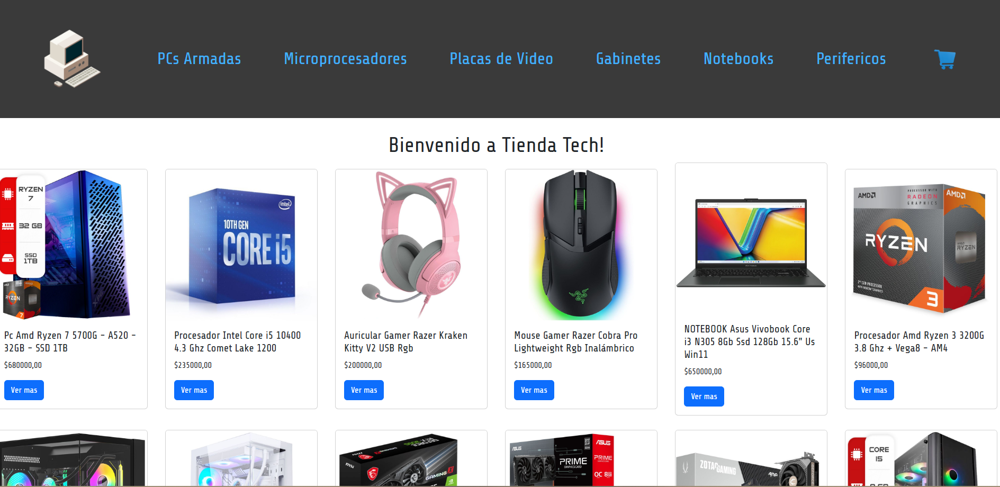

# 🛍️ **TechStore - E-commerce de Tecnología**

---

## 🧾 Descripción del proyecto

**TechStore** es una aplicación web desarrollada con **ReactJS** que simula una tienda online de productos tecnológicos.  
Permite navegar entre distintas categorías, visualizar detalles de los productos, agregarlos al carrito y finalizar la compra.  

Este proyecto fue desarrollado como **entrega final del curso ReactJS de Coderhouse**, aplicando los principales conceptos del ecosistema de React.

---

## ⚙️ Librerías utilizadas y motivos

| Librería | Versión | Uso principal |
|-----------|----------|----------------|
| ⚛️ **React** | ^19.1.1 | Biblioteca base para construir la interfaz del usuario. |
| 🧭 **React Router DOM** | ^7.9.1 | Manejo de rutas y navegación entre vistas. |
| 📝 **React Hook Form** | ^7.65.0 | Manejo y validación de formularios (checkout). |
| 🔥 **Firebase** | ^12.4.0 | Base de datos y gestión de órdenes de compra. |
| 🎨 **Bootstrap 5 / React Bootstrap** | ^5.3.8 / ^2.10.10 | Diseño responsive y componentes preconstruidos. |
| 🍬 **SweetAlert2** | ^11.26.2 | Alertas y mensajes visuales más atractivos. |
| ⚙️ **Vite** | ^7.1.2 | Entorno de desarrollo rápido y eficiente para React. |

🧠 Estas librerías fueron elegidas por su integración sencilla con React, su rendimiento, su soporte activo y porque permiten cumplir con los objetivos del proyecto:  
**navegación dinámica, manejo de formularios, base de datos en la nube y diseño adaptable.**

---

## 💻 Instalación y ejecución del proyecto

1. Clonar el repositorio desde GitHub:

    ```bash
    git clone https://github.com/AlexisCerullo/entregaFinal-CoderhouseReactJS
    ```

2. Ingresar al directorio del proyecto:

    ```bash
    cd entregaFinal-CoderhouseReactJS
    ```

3. Instalar las dependencias necesarias:

    ```bash
    npm install
    ```

4. Iniciar el servidor de desarrollo:

    ```bash
    npm run dev
    ```

5. Abrir el navegador en la dirección que indica la consola, generalmente:  
   👉 **http://localhost:5173/**


## 🌐 Link del deploy

🔗 [Ver sitio online](https://tulinkdedeploy.com)  


## 🖼️ Captura del inicio




## 📂 Repositorio del proyecto

🔗 [https://github.com/AlexisCerullo/entregaFinal-CoderhouseReactJS](https://github.com/AlexisCerullo/entregaFinal-CoderhouseReactJS)


## 👨‍💻 Autor

**Alexis Cerullo**  
📘 Proyecto final del curso **ReactJS - Coderhouse**  
📅 Año: 2025